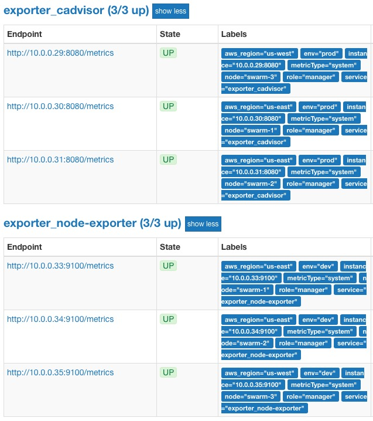

# Flexible Labeling with Docker Flow Monitor

*Docker Flow Monitor* and *Docker Flow Swarm Listener* can be configured to allow for more flexible labeling of exporters. Please read the  [Running Docker Flow Monitor](tutorial.md) tutorial before reading this one. This tutorial focuses on configuring the stacks to allow for flexible labeling.

## Setting Up A Cluster

!!! info
    Feel free to skip this section if you already have a Swarm cluster that can be used for this tutorial

We'll create a Swarm cluster consisting of three nodes created with Docker Machine.

```bash
git clone https://github.com/vfarcic/docker-flow-monitor.git

cd docker-flow-monitor

./scripts/dm-swarm.sh

eval $(docker-machine env swarm-1)
```

## Deploying Docker Flow Monitor

We will deploy [stacks/docker-flow-monitor-flexible-labels.yml](https://github.com/vfarcic/docker-flow-monitor/blob/master/stacks/docker-flow-monitor-flexible-labels.yml) stack that contains three services: `monitor`, `alert-manager` and `swarm-listener`. The `swarm-listener` service includes an additional environment variable: `DF_INCLUDE_NODE_IP_INFO=true`. This configures `swarm-listener` to send node information to `monitor` as labels. The node's hostname will be included in every metric from the exporter with the label: `node`.

In this tutorial, we will set up two additional labels: `env` and `metricType`. To enable these labels, we add the the environment variable: `DF_SCRAPE_TARGET_LABELS=env,metricType` to the `monitor` service:

```yaml
...
  monitor:
    image: vfarcic/docker-flow-monitor:${TAG:-latest}
    environment:
      - DF_SCRAPE_TARGET_LABELS=env,metricType
...
```

This sets up flexible labeling for our exporters. If an exporter defines a deploy label `com.df.env` or `com.df.metricType`, that label will be used by `monitor`.

We will also configure DFM to include node and engine labels in our targets by adding the environment variable: `DF_NODE_TARGET_LABELS=aws_region,role`. `aws_region` will be a label we will manually add to our nodes, and `role` is a label that is already included by DFSL. For a full list of all default node labels, please consult the [Node Notification docs](http://swarmlistener.dockerflow.com/usage/#node-notification).

!!! info
    Only `[a-zA-Z0-9_]` are valid characters in prometheus labels.

To get the nodes information, DFSL is configured to send node events to DFM by setting `DF_NOTIFY_CREATE_NODE_URL` and `DF_NOTIFY_REMOVE_NODE_URL`:

```yaml
...
  monitor:
    image: vfarcic/docker-flow-monitor:${TAG:-latest}
    environment:
      - DF_NODE_TARGET_LABELS=aws_region,role
      - DF_GET_NODES_URL=http://swarm-listener:8080/v1/docker-flow-swarm-listener/get-nodes
  ...
  swarm-listener:
    image: vfarcic/docker-flow-swarm-listener
    environment:
      ...
      - DF_NOTIFY_CREATE_NODE_URL=http://monitor:8080/v1/docker-flow-monitor/node/reconfigure
      - DF_NOTIFY_REMOVE_NODE_URL=http://monitor:8080/v1/docker-flow-monitor/node/remove
      - DF_INCLUDE_NODE_IP_INFO=true
...
```

Let's deploy the `monitor` stack:

```bash
docker network create -d overlay monitor

docker stack deploy \
    -c stacks/docker-flow-monitor-flexible-labels.yml \
    monitor
```

## Adding Labels to Nodes

We will now add the `aws_region` labels to our nodes. For DFM to recognize the labels, the labels must to be prefixed by `com.df.`:

```bash
docker node update --label-add com.df.aws_region=us-east swarm-1
docker node update --label-add com.df.aws_region=us-east swarm-2
docker node update --label-add com.df.aws_region=us-west swarm-3
```

## Collecting Metrics and Defining Alerts

We will deploy exporters stack defined in [stacks/exporters-tutorial-flexible-labels.yml](https://github.com/vfarcic/docker-flow-monitor/blob/master/stacks/exporters-tutorial-flexible-labels.yml),  two containing two services: `cadvisor` and `node-exporter`.

The definition of the `cadvisor` service contains additional deploy labels:

```yaml
  cadvisor:
    image: google/cadvisor
    networks:
      - monitor
    ...
    deploy:
      mode: global
      labels:
        ...
        - com.df.scrapeNetwork=monitor
        - com.df.env=prod
        - com.df.metricType=system
```

The `com.df.scrapeNetwork` deploy label tells `swarm-listener` to use `cadvisor`'s IP on the `monitor` network. This is important because the `monitor` service is using the `monitor` network to scrape `cadvisor`. The `com.df.env=prod` and `com.df.metricType=system` deploy labels configures flexible labeling for `cadvisor`.

The second service, `node-exporter` is also configured with flexiable labels:

```yaml
  node-exporter:
    image: basi/node-exporter
    networks:
      - monitor
    ...
    deploy:
      mode: global
      labels:
        ...
        - com.df.scrapeNetwork=monitor
        - com.df.env=dev
        - com.df.metricType=system
```

Let's deploy the `exporter` stack

```bash
docker stack deploy \
    -c stacks/exporters-tutorial-flexible-labels.yml \
    exporter
```

Please wait until the service in the stack are up-and-running. You can check their status by executing `docker stack ps exporter`.

Now we can open the *Prometheus* targets page from a browser.

> If you're a Windows user, Git Bash might not be able to use the `open` command. If that's the case, replace the `open` command with `echo`. As a result, you'll get the full address that should be opened directly in your browser of choice.

```bash
open "http://$(docker-machine ip swarm-1):9090/targets"
```

You should see a targets page similar to the following:



Each service is labeled with its associated `com.df.env` or `com.df.metricType` deploy label. In addition, the `node` label is the hostname the service is running on. The node labels `aws_region` and `role` are also included for each target.

## What Now?

*Docker Flow Monitors*'s flexible labeling feature provides more information about your services. Please consult the documentation for any additional information you might need. Feel free to open [an issue](https://github.com/vfarcic/docker-flow-monitor/issues) if you require additional info, if you find a bug, or if you have a feature request.

Before you go, please remove the cluster we created and free those resources for something else.

```bash
docker-machine rm -f swarm-1 swarm-2 swarm-3
```
